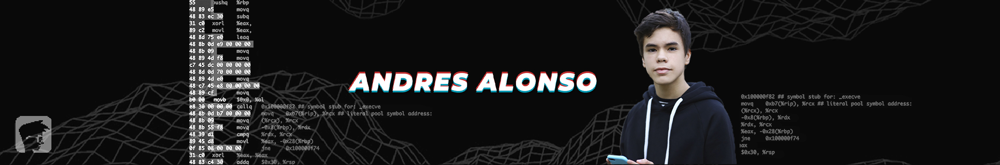

</img>
<h1 align="center">
  Andres Alonso
</h1>

  Scripts and app of my youtube channel 
  <a href=https://youtube.com/AndresAlonsoCanal>
   My Youtube Channel
  </a>

 

## 📄 Transformando ARQUIVOS EM IMAGENS
Script para transformar os bytes de um arquivo em pixels de uma imagem  
**[CÓDIGO](/RGB-Crypto/) - [VIDEO](https://www.youtube.com/watch?v=Vb2g05Kv_5A)**
> python | cryptography | os

 
## 📄 STJ H4CKEADO - CRIANDO UM RANSOMWARE  
Exemplo de um ransomware que criptografa arquivos em **.bob**  
**[CÓDIGO](/BOB-Ransomware/) - [VIDEO](https://www.youtube.com/watch?v=ELas5noeXiU)**
> python | pentest | ransomware

## 📄 PRIMEIRA LIVE - USANDO A API DO GITHUB
Código de uma live que crio um script integrado com a API do github  
**[CÓDIGO](/API-Github/)<!-- - [VIDEO](https://www.youtube.com/watch?v=ELas5noeXiU)-->**
> python | api | requests
